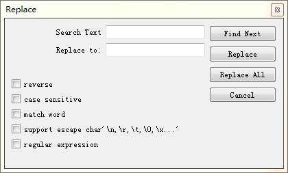
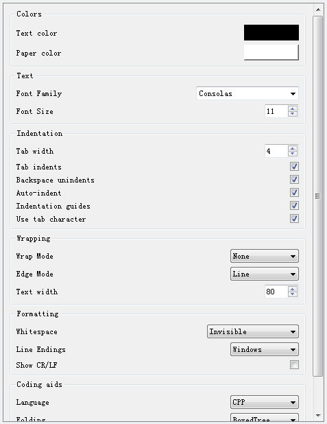

# CodeEditor
Syntax highlighting code editor. Easy to config.
 
A python editor package, based on QScintilla. support:

+ find and replace dialog
+ setting panel for config dialog
+ easy config api

# usage

Create editor, open file or find text:

~~~python
from CodeEditor import editor

edt = editor()      # create editor object
edt.load("file.c")  # file.c will be opened, and highlighted under c syntax
edt.save("file.c")  # file will be saved.
edt.setText("abc")  # content in editor will be replace by "abc"
edt.clear() # content in editor will be cleaned.
edt.find()  # show find dialog
edt.replace() # show replace dialog
~~~

find and replace dialog will dispaly as follow:

create setting panel:

~~~python
from CodeEditor import editor, EditorSettings

edt = editor()                  # create editor
setting = EditorSettings(edt)   # create setting boject
panel = setting.settingPanel()  # create setting panel
panel.apply()  # apply all change options in setting panel
panel.cancel() # cancel all change options and refresh setting panel
~~~

settingPanel is a Scrollable Qt Widget, it will display as follow:

config editor:

~~~python
from CodeEditor import editor
from PyQt5.QtCore import Qt

edt = editor()
# config method
edt.setLanguage("CSS")
edt.setFontSize(12)
edt.setBackgroundColor(Qt.blue)
# anothor config method
edt.configuate(language="CSS", fontSize=12, backgroundColor=Qt.blue)
~~~