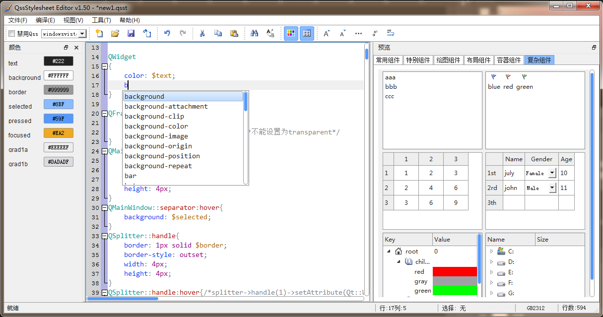

QssStylesheetEditor

English | [简体中文](readme.md)

QssStylesheetEditor is a powerful qt stylesheet(QSS) editor, it's opensource and free.

# introduction

+ Qss editor, preview Qss(qt stylesheet) in-time(almost all the qtwidgets can be previewed in the soft).
+ support code highlighting and code folding.
+ automatic prompt and completion the QSS keywords, attributes, pseudo elements, etc.
+ support to customize variables and reference them in QSS.
+ custom variable will be automatically displayed in the color panel, and your can change the color through the color dialog box.
+ reference image by relative path, image in resource files can be referenced too.
+ Support switching different system themes, such as xp theme, vista theme, etc. 
+ Support windows, Linux, UNIX and macos

# screenshot

")

# download and install

## windows 64bit
installer for windows 64bit is available.

Download：

+ QssStylesheetEditor_1.4_win64_installer **[[Download]](https://pan.baidu.com/s/1_Uf1lPHj14fs9iMG2SVXuQ)**(secuirity code: gwf8)
+ QssStylesheetEditor_1.4_win64_portable  **[[Download]](https://pan.baidu.com/s/1kGLlpD52N5-wg9IFf0CHPA)**(secuirity code: ze32)

## other os

there is no bin installer for other os. you can run QssStylesheetEditor following these steps：

+ install python3: following <http://python.org/>
+ install PyQt5:`pip instll PyQt5`
+ install Qscintilla：`pip instll Qscintilla`
+ Download and unzip QssStylesheetEditor, double click app.py or `python app.py`

# variable

本软件支持在qss中自定义变量，变量定义方式如下：

~~~
$background = #fff;
$border     = red;
~~~

变量引用方法：通过“$变量名”方式引用。参考如下：

~~~
QWidget
{
    color: $text;
    background-color: $background;
}
~~~

> qss中颜色等有很多相同的，使用变量后会大大减少工作量，方便修改。
> + 定义了变量的qss文件在QssStylesheetEditor中扩展名定义为qsst
> + 可以通过软件的导出功能，将qsst导出为qss文件
> > 当然也可以直接在QssStylesheetEditor软件中编辑qss样式

**QssStylesheetEditor自动识别添加变量,颜色拾取功能**

在QssStylesheetEditor中自定义一个变量后，在软件的颜色栏会自动显示变量名字和颜色，点击颜色可以用通过颜色拾取框选取变量颜色。

在QssStylesheetEditor中引用一个未定义的变量后，软件会自动识别，并在颜色栏显示该变量名字。如果通过颜色拾取框为该变量选择了颜色，这软件会自动在文档中添加该变量定义。

# 图片引用

## 相对路径引用

~~~css
background-image: url("img/close.png");
/* background-image: url(img/close.png); */
~~~

软件会在打开的xxx.qss文件所在的文件夹下查找img/close.png文件。

## 资源文件引用

~~~css
background-image: url(":/img/close.png");
/* background-image: url(:/img/close.png); */
~~~

软件会在当前打开的xxx.qss样式文件所在目录中搜索资源文件xxx.py并自动加载。

# screenshot

## 自动补全

## old version

<b>QssStylesheetEditor GUI V1.2</b>

    

<b>QssStylesheetEditor GUI V1.1</b>

    

<b>QssStylesheetEditor GUI V1.0</b>

    

